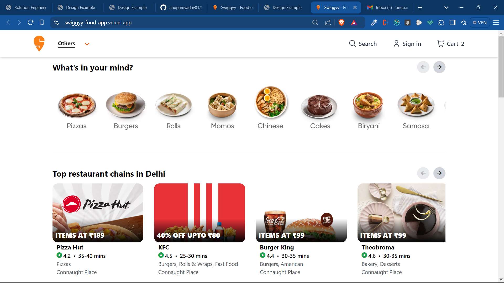
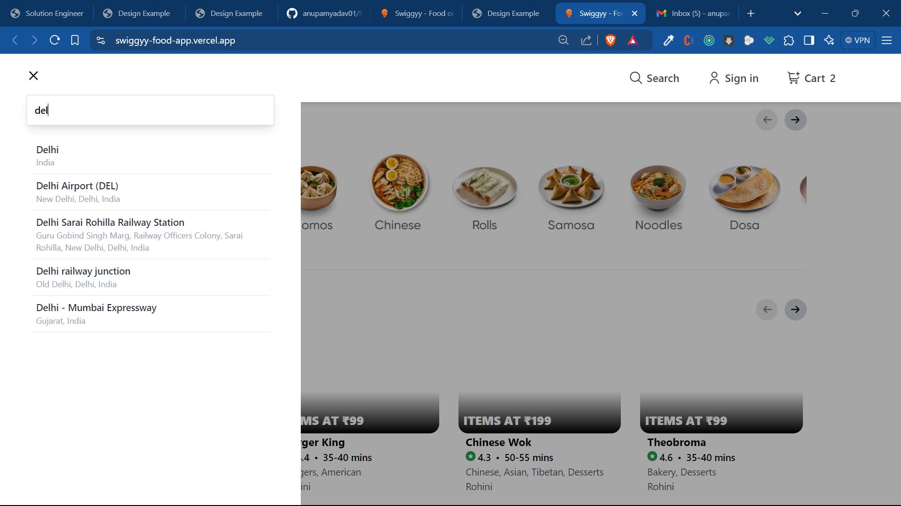
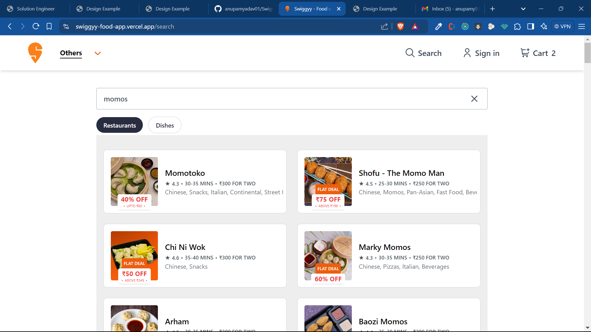
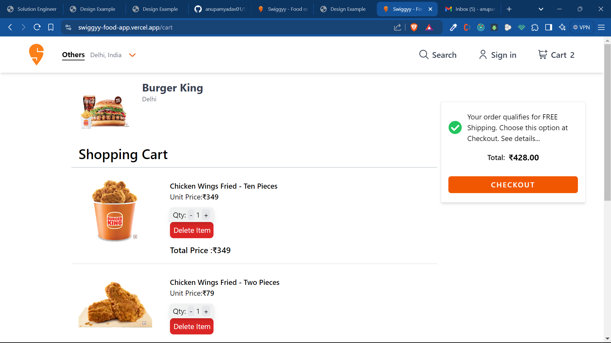
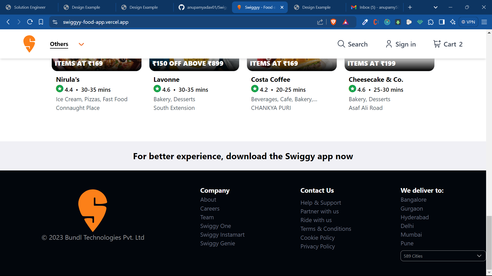

# 🍔 Swiggy - Online Food ordering app

## 📝 Overview

This is a food delivery web application built using React. The application allows users to browse various food items, add them to a cart, and place orders.

## ✨ Features

- 🔒 User authentication (sign up, login, logout)
- 🍽️ Browse food items by categories
- 🛒 Add/remove items to/from the cart
- 📦 Place orders
- 🕒 View order history
- 📱 Responsive design for mobile and desktop

## 💻 Technologies Used

- ⚛️ React
- 🛠️ Redux (for state management)
- 🚦 React Router (for navigation)
- 🌐 Axios (for API requests)
- 💅 Tailwind CSS
- 🔥 Firebase (for backend and authentication)

### ✅ Prerequisites

- 🟢 Node.js and npm installed on your machine
- 🔥 Firebase account (for backend services)
